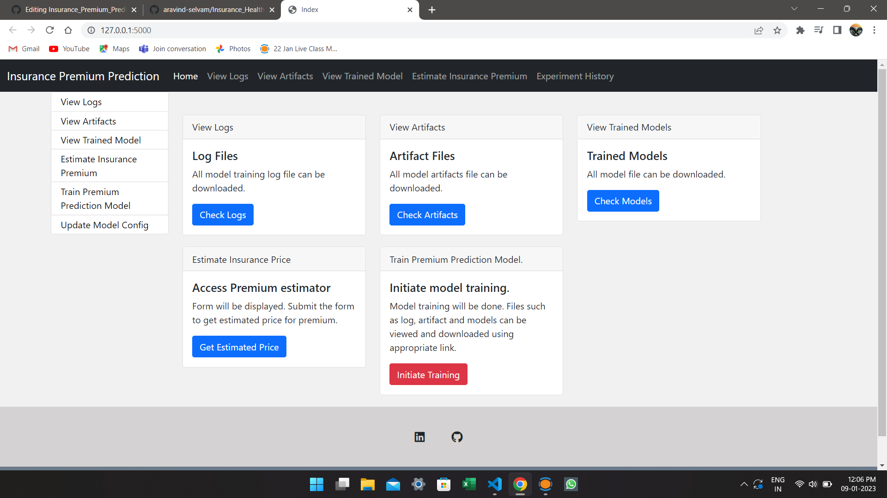
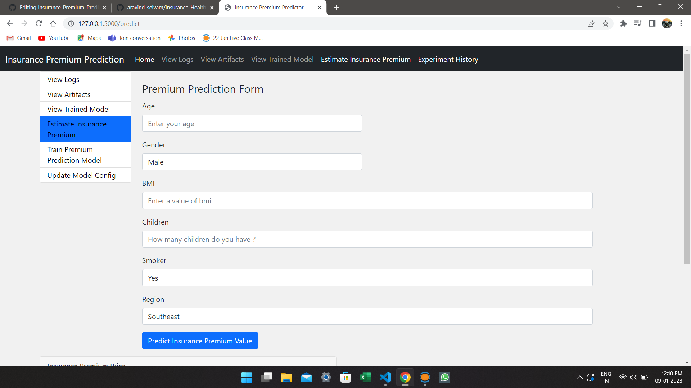

# Insurance_Premium_Prediction
# ineuron internship project
* The goal of this project is to give people an estimate of how much health risk they have based on their individual health situation. 
* After that, customers can work with any health insurance carrier and its plans and perks while keeping the projected cost from our model in mind. 
* This can assist a person in concentrating on the health side of an insurance policy rather han the ineffective part.

## 💿 Installing

### 1. Environment setup.
Run these commands in CLI
```
conda create -p <env_name> python==3.9 -y
```
```
conda activate venv/
````
### 2. Install Requirements and setup
```
pip install -r requirements.txt
```
### 3. Run Application
```
Python app.py
```

## 🔧 Built with
- Flask
- Python 3.9
- Machine learning
- 🏦 Industrial Use Cases

## Models Used
* Linear Regression
* Lasso Regression
* Ridge Regression
* K-Neighbors Regressor
* Decision Tree
* Random Forest Regressor
* XGBRegressor
* CatBoosting Regressor
* AdaBoost Regressor

From these above models after hyperparameter optimization we selected Top two models which were Xgboost and Random Forest Regressors and used the following in Pipeline.

* GridSearchCV is used for Hyperparameter Optimization in the pipeline.

* Any modification has to be done in  Inside Config.yaml which can be done in route **/update_model_config**

## Insurance is the main package folder which contains 

**Artifact** : Stores all artifacts created from running the application

**Components** : Contains all components of Machine Learning Project
- DataIngestion
- DataValidation
- DataTransformations
- ModelTrainer
- ModelEvaluation
- ModelPusher

**Custom Logger and Exceptions** are used in the Project for better debugging purposes.

## Application Screenshots
### **This is the screenshot of the final Webpage which was done using the Flask**
#

### **This is the screenshot of the webpage which gets user input for prediction**
#

### **This is the screenshot of the page which shows history of the experiment that was Run**
#### Can be used as experiment history Tracking
#

### **This is the screenshot of the page in which user can change the model parameters for the experiment**
#

## Conclusion
- This Project can be used in real-life by Medical Insurance Companies to predict the Health risk involved for a patient and give an estimate for Insurance Premium for the particular customer.


